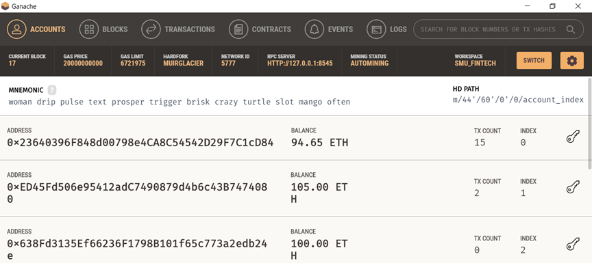

## Building an hierarchical deterministic(HD) Wallet in Python that will allow storing and transferring of multiple types of crypto with only one mnemonic phrase for all using [hd-derive-wallet](https://github.com/dan-da/hd-wallet-derive).

### First, we need to install hd-wallet-derive by opening a terminal(git bash) and entering in the following:
---
    git clone 
    cd hd-wallet-derive
    curl https://getcomposer.org/installer -o installer.php
    php composer.phar install
---
### Next, let's go into the directory of the hd-wallet-derive application and enter in the following commands in git bash to make sure our installation went smoothly:
---
    ./hd-wallet-derive.php -g --key=xprv9tyUQV64JT5qs3RSTJkXCWKMyUgoQp7F3hA1xzG6ZGu6u6Q9VMNjGr67Lctvy5P8oyaYAL9CAWrUE9i6GoNMKUga5biW6Hx4tws2six3b9c --numderive=3 --preset=bitcoincore --cols=path,address --path-change
---
If our installation was successful, the resulting output should look like this:

### Now, we need a mnemonic phrase. We can generate a BIP39 mnemonic for our wallet on the following website:
[Mnemonic Phrase Generator](https://bip39converttool.io/)
Save this mnemonic phrase in a safe place and make sure to NOT LOSE IT!

### We are now ready to download the `wallet.py` script. You can download the script from this repository:
---
    git clone git@github.com:shweta_kumawat/Multi-Blockchain_Wallet_in_Python.git
    cd Multi-Blockchain_Wallet_in_Python
---
The directory of `wallet.py` when opened in VSCode should look like this:

---
### Remember the mnemonic phrase we created earlier? Let's add that to a `.env` file that will save it for future use:
---
    touch .env
    cat > .env 
    mnemonic = "your 12 word mnemonic phrase here"
---
To close the application, press Ctrl+d

### Let's open up our Jupyter Notebook and import our wallet
---
We will begin by importing our dependencies and loading our environment that will be accessing our mnemonic phrase:
---
    import subprocess
    import json
    from dotenv import load_dotenv
    from constants import BTC, ETH, BTCTEST
    import bit
    from bit.network import NetworkAPI
    from web3 import Web3
    from web3.middleware import geth_poa_middleware
    import os
    import lit
    from web3 import Web3, middleware, Account
    from bit import PrivateKeyTestnet
    from web3.gas_strategies.time_based import medium_gas_price_strategy

    load_dotenv()
    mnemonic = os.getenv("mnemonic")
---
### Now we need to create an ETH connection object. You can use a Proof-of-Authority blockchain like the one found [here](https://github.com/BenMcCright/Proof_of_Authority_Development_Chain). For this example, I will be using Ganache.

- Notice that the port number is 8545
### Let's get back to our python notebook and enter in the following code to connect:
---
    w3 = Web3(Web3.HTTPProvider('http://127.0.0.1:8545'))

    w3.isConnected()

    w3.middleware_onion.inject(geth_poa_middleware, layer = 0)

    w3.eth.setGasPriceStrategy(medium_gas_price_strategy)
---
### Now we will create a function called `derive_wallets` that will generate a wallet object for Bitcoin(BTC), Ethereum(ETH), and BitcoinTest(BTCTEST):
---
    def derive_wallets(mnemonic = mnemonic, coin = BTC, depth = 3):
        command = f'php ./derive -g --mnemonic="{mnemonic}" --cols=all --coin={coin} --numderive={depth} --format=json'
        p = subprocess.Popen(command, stdout=subprocess.PIPE, shell=True)
        output, err = p.communicate()
        p_status = p.wait()
        return json.loads(output)
---
### Next, we will create a dictionary object called `coins` to store the output from `derive_wallets`:
---
    coins = {BTCTEST: derive_wallets(coin = BTCTEST), ETH: derive_wallets(coin = ETH)}
---
The wallet object that was created will look similar to this:

---
### Let's make a few more functions. We will start with one that converts the privkey strings to account objects.
--- 
    def priv_key_to_account(coin, private_key):
        if coin == ETH:
            return Account.privateKeyToAccount(private_key)
        if coin == BTCTEST:
            return PrivateKeyTestnet(private_key)
---
### Next, let's create a function that creates an unsigned transaction appropriate metadata.
---
    def create_tx(coin, account, to, amount):
        if coin == ETH:
            value = w3.toWei(amount, "ether") # convert 1.2 ETH to 120000000000 wei
            gasEstimate = w3.eth.estimateGas({ "to": to, "from": account, "amount": value })
            return {
                "to": to,
                "from": account,
                "value": value,
                "gas": gasEstimate,
                "gasPrice": w3.eth.generateGasPrice(),
                "nonce": w3.eth.getTransactionCount(account),
                "chainId": w3.eth.chain_id
                }
        if coin == BTCTEST:
            return PrivateKeyTestnet.prepare_transaction(account.address, [(to, amount, BTC)])
---
### Lastly, we will create a `send_tx` function that will call upon the `create_tx` above, sign and sends the transaction.
---
    def send_tx(coin, account, to, amount):
        if coin == ETH:
            raw_tx = create_tx(coin, account.address, to, amount)
            signed = account.signTransaction(raw_tx)
            return w3.eth.sendRawTransaction(signed.rawTransaction)
        if coin == BTCTEST:
            raw_tx = create_tx(coin, account, to, amount)
            signed = account.sign_transaction(raw_tx)
            return NetworkAPI.broadcast_tx_testnet(signed)
---
## We have now successfully built an HD multi-crypto wallet in Python that will facilitate transactions!